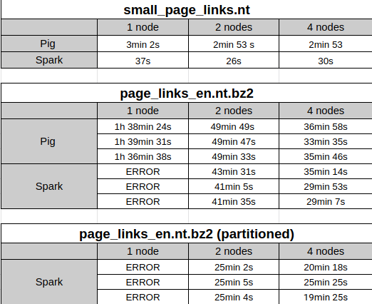
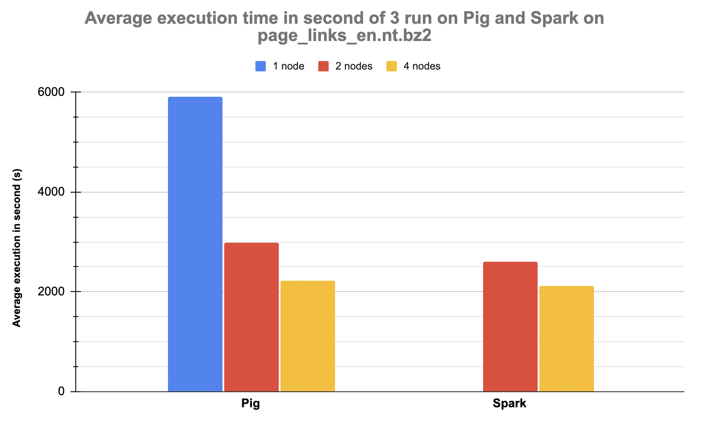

# Large Scale Data Management

## Contributors

POIRIER Florian\
FORTINEAU Romain\
BOIS Jean-Maël

## Running

See `cmd.txt` file

Spark is launched with partitionned data by default. If you want to launch with unpartitionned data, put lines 84, 85 and 86 as comments.

## Results

We decided to make 3 runs for each node in order to have an accurate benchmark for the page_links_en.nt.bz2 file.

In the following table, we have results for small_page_links.nt data file and page_links_en.nt.bz2 (with and without partitionning).

The capacity allocated to the machines was not sufficient to allow execution on a single Spark node.

We have made a graph to visualize the average execution time for each node. 

Then, we calculated the best ranking among all the pages. The max rank is `http://dbpedia.org/resource/Living_people` with a score of 36794.33146754496. 

## Conclusion

In conclusion, we can see that Spark is faster than Pig on the big data files (page_links_en.nt). Besides, with partitionning, Spark is faster.
